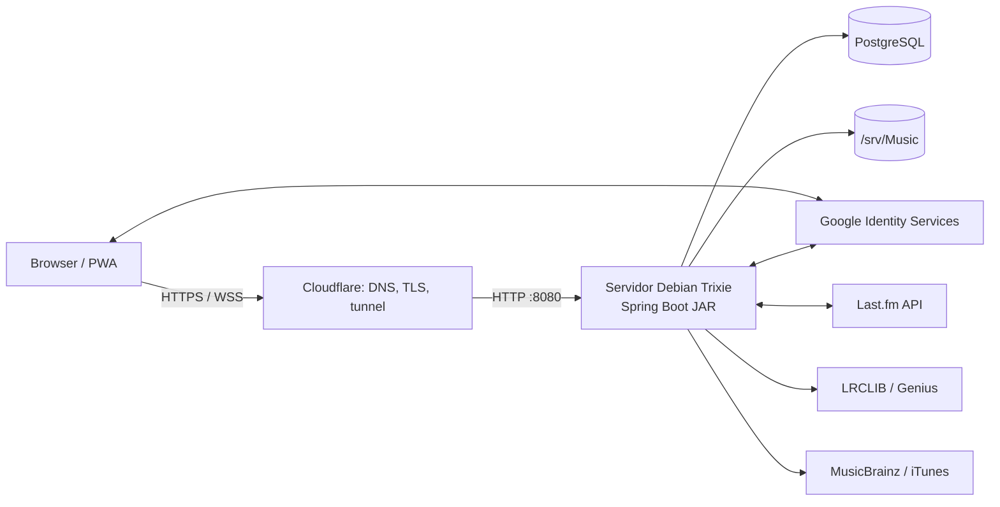
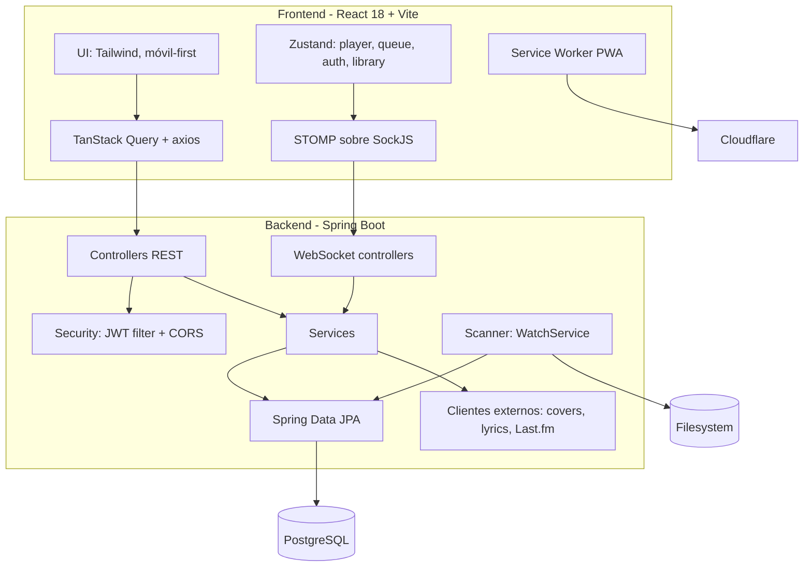
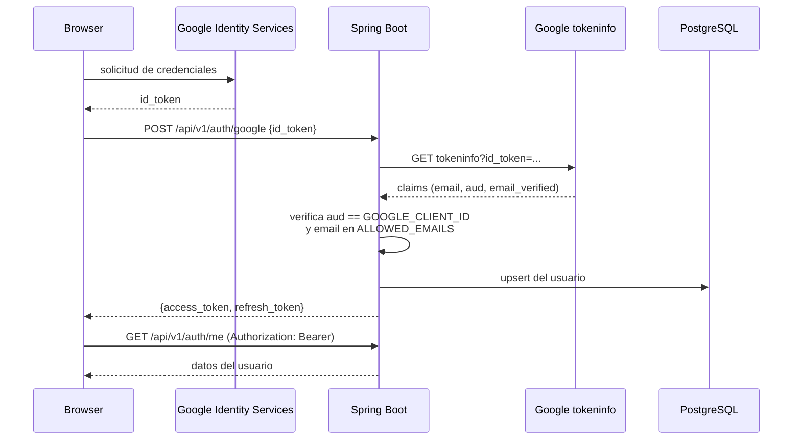
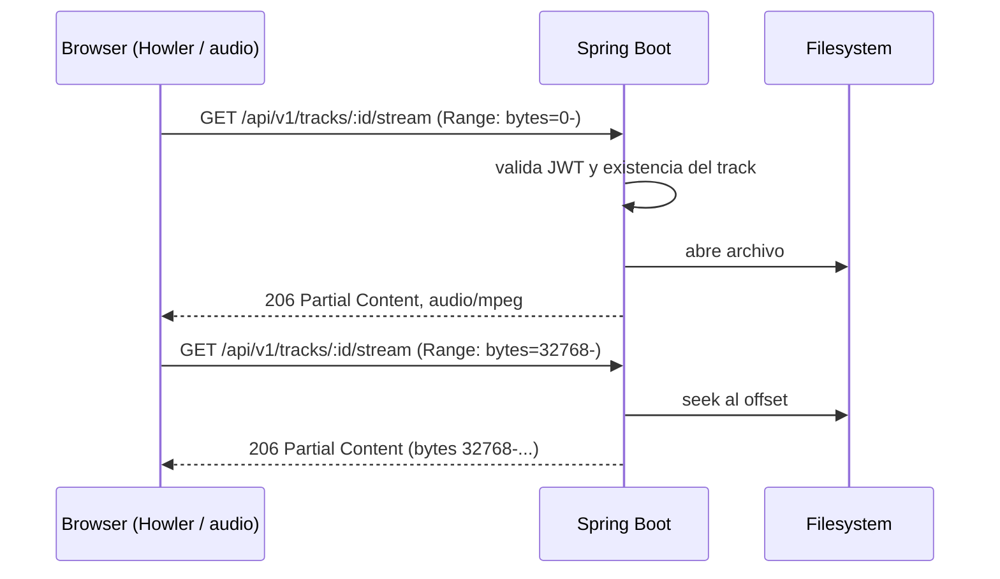
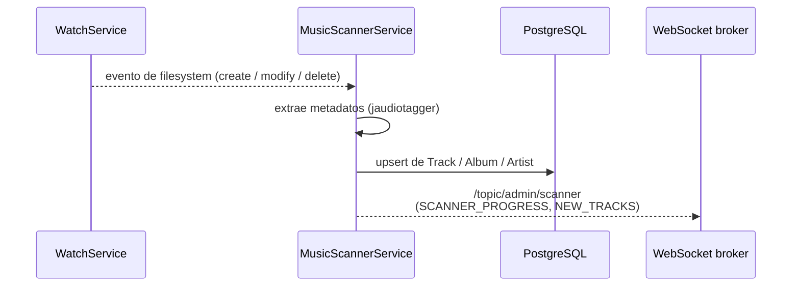
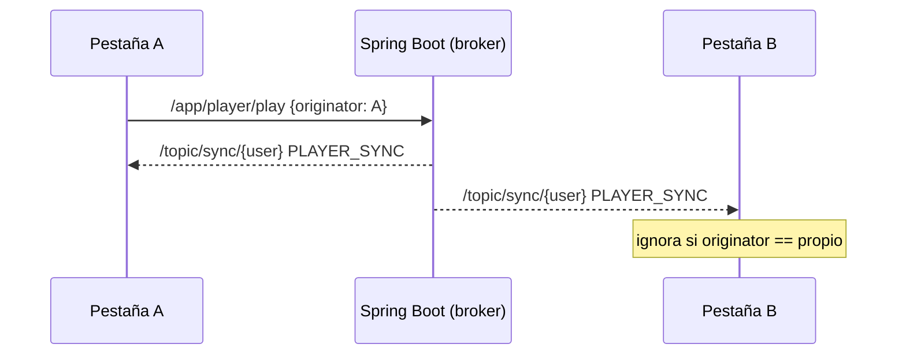
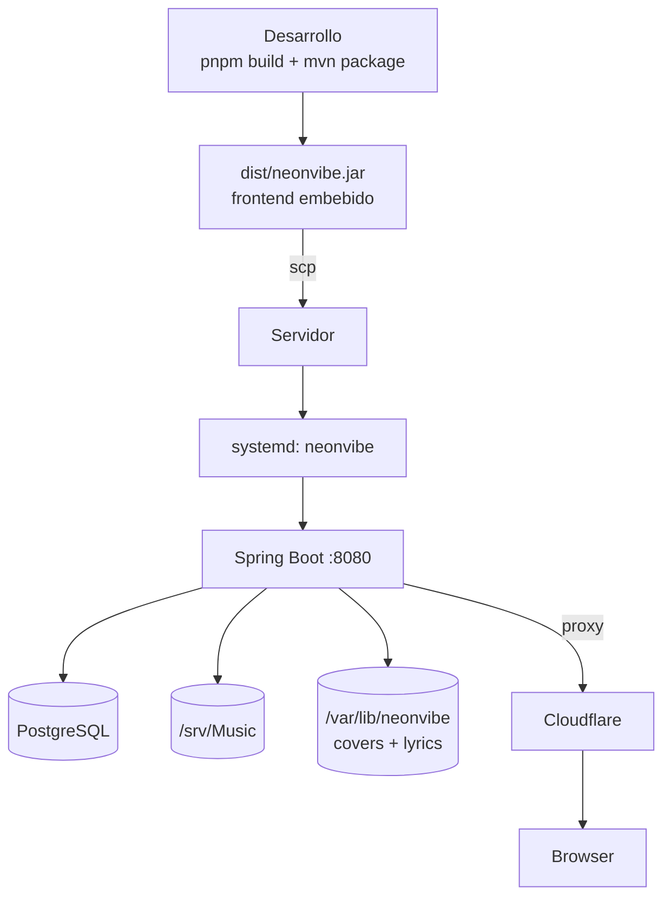

# Arquitectura — NeonVibe

> Documento de arquitectura orientado a personas. Define los componentes, los
> flujos clave y las decisiones de diseño del sistema. El contexto operativo para
> agentes de código vive en `AGENTS.md`.

## 1. Resumen

NeonVibe es un servidor de música personal self-hosted. Consiste en un backend
Spring Boot (Java 21) que sirve una API REST JSON, un frontend React servido como
recurso estático embebido en el mismo JAR, y un canal de tiempo real STOMP sobre
WebSocket. Se ejecuta como un único proceso en un servidor Debian Trixie
bare-metal, detrás de Cloudflare, contra PostgreSQL.

La biblioteca de audio se lee directamente del filesystem (`/srv/Music`); no hay
copia ni transcodificación.

## 2. Contexto del sistema

- El navegador habla únicamente con Cloudflare; el servidor no expone otros
  puertos a Internet.
- El backend valida los `id_token` de Google contra `tokeninfo`; no usa
  `spring-security-oauth2-client` para el login.
- La música se sirve por HTTP Range requests; el frontend hace seek sobre el
  archivo sin transcodificación.

## 3. Componentes

Módulos backend (`com.neonvibe.*`):

| Paquete | Responsabilidad |
|---|---|
| `controller` | Endpoints REST bajo `/api/v1` |
| `service` | Lógica de negocio (auth, librería, cola, radio, ...) |
| `repository` | Acceso a datos Spring Data JPA |
| `security` | `JwtAuthenticationFilter`, emisión/validación de JWT |
| `scanner` | WatchService + extracción de metadatos (jaudiotagger) |
| `websocket` | `@MessageMapping` de reproductor/cola y bridge de scanner |
| `config` | Seguridad, CORS, WebSocket (STOMP), Jackson |
| `infra` | Clientes HTTP: MusicBrainz, Last.fm, LRCLIB |
| `dto`, `domain`, `mapper` | Contratos de API, entidades JPA, mapeo |

## 4. Autenticación (Google + JWT)

Decisiones relevantes:

- **Sesión stateless:** access token de 15 min + refresh de 7 días. El backend no
  guarda sesiones en memoria.
- **Verificación del `aud`:** `tokeninfo` prueba que el token es auténtico, no que
  se emitiera para esta app. Sin este chequeo, un `id_token` de cualquier otra
  web con Google Sign-In serviría para entrar.
- **Allowlist obligatoria en prod:** `ALLOWED_EMAILS`; fuera de la lista se
  responde `403`.
- **`ProdStartupGuard`:** en perfil `prod` la app no arranca sin `JWT_SECRET`,
  `GOOGLE_CLIENT_ID` y `ALLOWED_EMAILS`.

## 5. Streaming (HTTP Range)

- El endpoint responde `206` y procesa `Range`, lo que habilita el seek del
  reproductor. Sin esto, arrastrar la barra de progreso reinicia la canción.
- El JWT viaja en query param solo en los endpoints de media
  (`/stream`, `/cover`).

## 6. Scanner

- Detección en tiempo real mediante `java.nio.file.WatchService`; además existe
  un trigger manual (`POST /api/v1/admin/scan`).
- El escaneo corre fuera del hilo de requests (`@Async` / executor); no bloquea
  la API.
- Los archivos borrados se marcan `is_available=false` (no se eliminan registros).

## 7. Sync multi-dispositivo (WebSocket)

- Endpoint `/ws` (STOMP sobre SockJS), `GET /ws/info` es el handshake de SockJS.
- Cliente → servidor (`/app`): `player/play`, `player/pause`, `player/seek`,
  `player/next`, `player/prev`, `queue/update`.
- Servidor → cliente: `/topic/sync/{userId}` (`PLAYER_SYNC`, `QUEUE_UPDATED`) y
  `/topic/admin/scanner` (`SCANNER_PROGRESS`, `NEW_TRACKS`).
- Todos los mensajes llevan un `originator` (id de cliente) para que cada pestaña
  ignore su propio eco.

## 8. Despliegue

- Un solo artefacto (JAR con el frontend dentro); no hay Nginx: Cloudflare
  termina TLS y reenvía a `:8080`.
- Despliegue atómico: `deploy/deploy.sh` copia el JAR con `mv` y reinicia el
  servicio, validando el health check.
- El procedimiento completo está en `docs/DEPLOY.md`.

## 9. Decisiones de diseño clave

| Decisión | Alternativa descartada | Razón |
|---|---|---|
| Monorepo simple (`backend/` + `frontend/`) | Nx/Lerna | Sin over-engineering para el tamaño del proyecto |
| API first + WebSocket solo para sync | GraphQL / eventos para todo | Contrato REST simple; WS solo para estado de reproductor |
| Validación `id_token` contra `tokeninfo` | Claves JWK locales | Más simple; trade-off: requiere salida a Internet |
| Scanner con WatchService | Polling periódico | Detección en tiempo real sin coste de barrido |
| Frontend embebido en el JAR | Frontend separado en CDN/Nginx | Un solo artefacto, despliegue trivial |
| Stream por HTTP Range sin transcodificación | FFmpeg on-the-fly | MVP; transcodificar queda para el quality selector |
